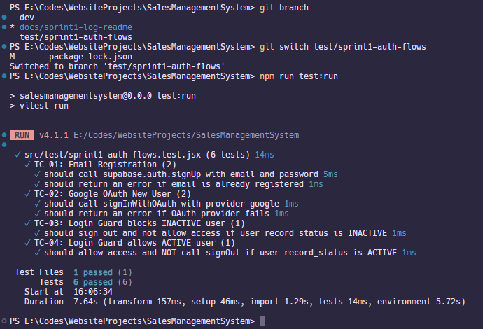

# Sprint 1 Log — HopeINC Sales Management System

**Sprint Duration:** March 25, 2026 – March 31, 2026
**Theme:** Project Setup, SMS Database & Authentication
**Prepared by:** Ven Angel Tagaro (M5 – QA / Documentation)

---

## Team Members

| Member | Name              | Role                                |
| ------ | ----------------- | ----------------------------------- |
| M1     | Aldro Altar       | Project Lead / Full-Stack Developer |
| M2     | Thyrone Ascunsion | Frontend Developer (UI/UX)          |
| M3     | Josh Singson      | Backend / Database Engineer         |
| M4     | Cyden Centeno     | Rights & Authentication Specialist  |
| M5     | Ven Angel Tagaro  | QA / Documentation Specialist       |

---

## Tasks Completed

### M1 — Aldro Altar

- ✅ Initialized project with Vite + React 18 + Tailwind CSS (`feat/project-scaffold` → PR #1)
- ✅ Set up Supabase JS client and `.env` configuration (`feat/supabase-client` → PR #2)
- ✅ Built routing skeleton with ProtectedRoute and all placeholder pages (`feat/routing-skeleton` → PR #3)
- ✅ Added branch protection rules, PR template, and README (`chore/github-protection` → PR #6)

### M2 — Thyrone Ascunsion

- 🔄 Login page in progress (`feat/ui-login-page`) — placeholder only, no logic yet
- 🔄 Register page in progress (`feat/ui-register-page`) — placeholder only, no logic yet
- 🔄 App shell (Navbar + Sidebar) in progress (`feat/ui-app-shell`) — PR #5 open

### M3 — Josh Singson

- 🔄 Database setup in progress (`feature/database`) — Supabase project created, credentials not yet shared with team

### M4 — Cyden Centeno

- 🔄 AuthContext in progress (`feat/auth-context`) — file exists but not yet implemented

### M5 — Ven Angel Tagaro

- ✅ Vitest + React Testing Library confirmed installed and configured
- ✅ Sprint 1 auth flow test cases written and passing — 6/6 tests (`test/sprint1-auth-flows` → PR open)
- ✅ Sprint 1 log written (`docs/sprint1-log-readme`)

---

## Blockers

| Blocker                                     | Affected Member                 | Status           |
| ------------------------------------------- | ------------------------------- | ---------------- |
| Supabase `.env` credentials not shared      | M5 (cannot run app locally)     | ⏳ Waiting on M3 |
| `feat/auth-context` not yet merged into dev | M5 (tests are mocked, not real) | ⏳ Waiting on M4 |
| Login/Register pages are placeholders only  | M5 (cannot test UI flows)       | ⏳ Waiting on M2 |

---

## Test Results

| Test Case | Description                                   | Result  |
| --------- | --------------------------------------------- | ------- |
| TC-01a    | signUp called with email and password         | ✅ PASS |
| TC-01b    | Returns error if email already registered     | ✅ PASS |
| TC-02a    | signInWithOAuth triggers with provider google | ✅ PASS |
| TC-02b    | Returns error if OAuth provider fails         | ✅ PASS |
| TC-03     | Login guard signs out INACTIVE user           | ✅ PASS |
| TC-04     | Login guard allows ACTIVE user through        | ✅ PASS |

> **Note:** All tests are currently mocked — they simulate Supabase behavior but do not test real AuthContext logic yet. Tests will be updated once `feat/auth-context` is merged into dev.

---

## Resolutions

- Supabase env blocker → to be resolved by M3 sharing credentials before Sprint 1 ends
- Auth flow tests → written as mocked placeholders; will be updated in Sprint 2 once real auth code is merged

---

## Sprint 1 Gate Checklist

- [ ] All 6 HopeDB tables seeded with correct row counts
- [ ] Login guard works for email auth
- [ ] Login guard works for Google OAuth
- [ ] All placeholder pages accessible via routing
- [ ] Branch protection rules active on `dev` and `main`

---

## Goals for Sprint 2

- Update auth flow tests to use real `AuthContext` logic once merged
- Write rights test matrix (3 user types × 13 rights = 39 test cases)
- Test cascade soft-delete and recovery behavior
- Test lookup-only enforcement on all 4 lookup pages
- Test price auto-fill behavior on AddLineItemModal
- Write Sprint 2 log
