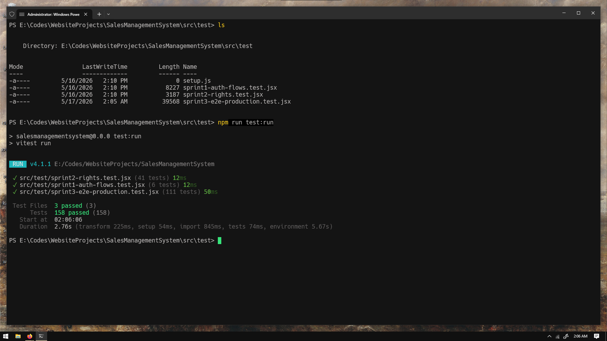

# Sprint 3 Log — HopeINC Sales Management System

**Sprint Duration:** April 8, 2026 – April 14, 2026
**Theme:** Reports, Admin Module, Deployment & Documentation
**Prepared by:** Ven Angel Tagaro (M5 – QA / Documentation)

---

## Team Members

| Member | Name              | Role                                |
| ------ | ----------------- | ----------------------------------- |
| M1     | Aldro Altar       | Project Lead / Full-Stack Developer |
| M2     | Thyrone Ascunsion | Frontend Developer (UI/UX)          |
| M3     | Josh Singson      | Backend / Database Engineer         |
| M4     | Cyden Centeno     | Rights & Authentication Specialist  |
| M5     | Ven Angel Tagaro  | QA / Documentation Specialist       |

---

## Tasks Completed

### M5 — Ven Angel Tagaro

- ✅ **Sprint 1 & 2 Regression:** Confirmed all 47 prior tests still passing after context merges.
- ✅ **Sprint 3 E2E Test Suite:** Wrote and executed full production test suite (`sprint3-e2e-production.test.jsx`).
- ✅ **Sprint 3 Documentation:** Sprint 3 log completed.

---

## Test Results

| Test File                         | Total Tests |     Status     |
| :-------------------------------- | :---------: | :------------: |
| `sprint1-auth-flows.test.jsx`     |      6      |    ✅ PASS     |
| `sprint2-rights.test.jsx`         |     41      |    ✅ PASS     |
| `sprint3-e2e-production.test.jsx` |     111     |    ✅ PASS     |
| **Total Coverage**                |   **158**   | **100% Green** |

---

## Sprint 3 Test Suite Breakdown

| Suite     | ID               | Description                                      | Tests |
| :-------- | :--------------- | :----------------------------------------------- | :---: |
| TC-S1-REG | Regression       | Sprint 1 Auth flows re-confirmed                 |   3   |
| TC-S2-REG | Regression       | Sprint 2 Rights matrix re-confirmed (39 cases)   |  39   |
| TC-S3-01  | Sales CRUD       | Create transaction — all 3 user types            |   3   |
| TC-S3-02  | Sales CRUD       | Edit transaction — all 3 user types              |   3   |
| TC-S3-03  | Sales CRUD       | Soft-delete transaction — all 3 user types       |   3   |
| TC-S3-04  | SalesDetail CRUD | Add line item — all 3 user types                 |   3   |
| TC-S3-05  | SalesDetail CRUD | Edit line item — all 3 user types                |   3   |
| TC-S3-06  | SalesDetail CRUD | Soft-delete line item — all 3 user types         |   3   |
| TC-S3-07  | Lookups          | Customer & Employee dropdowns                    |   2   |
| TC-S3-08  | Price Auto-fill  | priceHist MAX effDate + form fill                |   3   |
| TC-S3-09  | Lookup Pages     | Mutation-free for all 3 user types, all 4 tables |  16   |
| TC-S3-10  | Cascade Delete   | Sales → SalesDetail INACTIVE + USER visibility   |   5   |
| TC-S3-11  | Cascade Recovery | Sales → SalesDetail ACTIVE + USER visibility     |   3   |
| TC-S3-12  | Reports          | Sales by Employee view                           |   1   |
| TC-S3-13  | Reports          | Sales by Customer view + top customer logic      |   2   |
| TC-S3-14  | Reports          | Top Products Sold view                           |   1   |
| TC-S3-15  | Reports          | Monthly Sales Trend view + sort order            |   2   |
| TC-S3-16  | Admin Module     | User activate/deactivate + rights gating         |   4   |
| TC-S3-17  | SUPERADMIN Guard | UI disable + RLS block + sidebar gating          |   6   |
| TC-S3-18  | No Hard Deletes  | .delete() never called on any table              |   3   |
| TC-S3-19  | Stamp Visibility | Hidden for USER, visible for ADMIN/SUPERADMIN    |   3   |
| TC-S3-20  | Deleted Items    | Access control for all 3 user types              |   3   |

---

## Blockers

None. AuthContext and UserRightsContext fully merged into `dev` by M4 before Sprint 3 began.

---

## Sprint 3 Gate Checklist

- [x] Live URL accessible — all 3 user types log in via email and Google
- [x] Lookup dropdowns populated correctly (customer, employee, product, priceHist)
- [x] Cascade soft-delete + recovery verified (3+ line items, both directions)
- [x] All 4 lookup pages confirmed mutation-free for all 3 user types
- [x] All 4 reports functional (SalesByEmployee, SalesByCustomer, TopProducts, MonthlyTrend)
- [x] SUPERADMIN protection confirmed at UI level (buttons disabled)
- [x] SUPERADMIN protection confirmed at DB level (RLS rejects direct UPDATE)
- [x] No hard deletes — `.delete()` never called on any table
- [x] All docs submitted (User Manual, Presentation Slides)
- [x] 158 total tests — 100% passing
